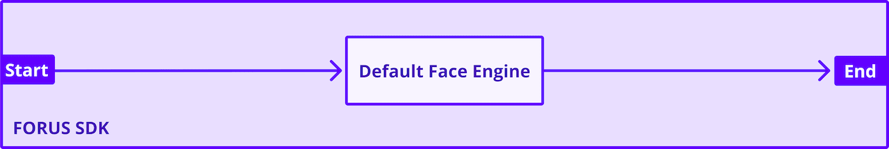
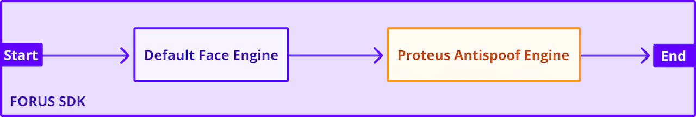

# FORUS SDK (ANDROID)


Forus SDK is a touch-free, face image capture solution for a perfect KYC compliant photograph.

Key features are,
- Face and liveness detection
- Anti-Spoof detection
- Watermarking photo
- Face image crop, compress, quality enhancements like blur and shake detection

You can find the latest changelog at [Changelog](CHANGELOG.md). Documentation for older versions (3.X.X) can be found [here](https://github.com/frslabs/forus-android/tree/3.X.X).

‼ ATTENTION ‼ → BREAKING CHANGE introduced at Forus SDK `v4.2.1`. We have introduced a new license format. If you are using versions prior to `v4.2.1` and intend to update to `v4.2.1` or above, contact `support@frslabs.com` for an updated license.

# Table Of Content

- [Prerequisite](#prerequisite)
- [Overview of Forus SDK Libraries](#overview-of-forus-sdk-libraries)
  - [Forus SDK](#forus-sdk)
  - [Forus Proteus Antispoof SDK](#forus-proteus-antispoof-sdk)
  - [Forus Core Face Mask SDK](#forus-core-face-mask-sdk)
  - [Forus SDK Libraries Landscape](#forus-sdk-libraries-landscape)
- [Set Up Forus SDK](#set-up-forus-sdk)  
  - [Requirements](#requirements)
  - [Download Forus SDK](#download-forus-sdk)
  - [Importing Forus SDK](#importing-forus-sdk)
  - [Importing Forus Proteus Antispoof SDK](#importing-forus-proteus-antispoof-sdk)
  - [Forus Core Face Mask SDK](#importing-core-face-mask-sdk)
- [Quick Start](#quick-start)
  - [Initialise and run the Forus SDK](#initialise-and-run-the-forus-sdk)
  - [Enabling Forus Proteus Antispoof SDK](#enabling-forus-proteus-antispoof-sdk)
  - [Enabling Forus Core Face Mask SDK](#enabling-forus-core-face-mask-sdk)
- [Forus Result](#forus-result)
- [Forus Error Codes](#forus-error-codes)
- [Forus SDK API](#forus-sdk-api)
- [Permissions](#permissions)
- [Help](#help)

## Prerequisite

You will need a valid license to use the Forus SDK, which can be obtained by contacting `support@frslabs.com` .

Depending on the license - offline or online - you have opted for, the ping functionality to billing servers will be disabled or enabled. For instance, if you have opted for the offline SDK model, then there will be no server ping needed to our billing server to bill you. However, if you have chosen a transaction based pricing, then after each transaction, a ping request will be made to our billing server. This cannot be overrided by the App. A point to note is that if the ping transaction fails for any reason, the whole transaction will be void without any results from the SDK.

Once you have the license , follow the below instructions for a successful integration of Forus SDK onto your Android Application.

## Overview of Forus SDK Libraries

This section lists the Forus SDK Libraries that are available for Android with their gradle dependencies, latest version and their size.

| SDK Library                                 | Gradle dependency                                 | Latest version  | Size                    |
| --------------------------------------------| ------------------------------------------------- | --------------- | ----------------------- |
| [Forus SDK](#forus-sdk) (Required)                                     | com.frslabs.android.sdk:forus                     |     | 350 KB     |
| [Core Face Bundled SDK](#core-face-bundled-sdk) (Required) | com.frslabs.android.sdk:core-face-bundled  |      | 6.2 MB     |
| [Forus Proteus Antispoof SDK](#forus-proteus-antispoof-sdk) (Optional) | com.frslabs.android.sdk:forus-proteus-antispoof   |      | 4.5 MB     |
| [Forus Core Face Mask SDK](#forus-core-face-mask-sdk) (Optional)    | com.frslabs.android.sdk:core-face-mask |   | 3.1 MB |


#### Forus SDK
This is the core SDK that provides a no-contact photo capture solution with face and liveness detection among other features. Its extremely customisable and gives you the captured face image as the result.

Steps to add and initialise the Forus SDK,
- To get started with setting up Forus SDK, refer [Set Up Forus SDK](#set-up-forus-sdk)
- To integrate the Forus SDK, Refer [Initialise and run the Forus SDK](#initialise-and-run-the-forus-sdk)

#### Face Dependencies
Forus uses Face detection capabilities via either of these two dependencies, and it is required to include any one of them. [Core Face Bundled SDK](#core-face-bundled) and [Core Face Unbundled SDK](#core-face-unbundled). If size is not an issue, we recommend going with the Core Face Bundled SDK. More details about these dependencies are found below.
##### Core Face Bundled SDK
Include this dependency if size of the SDK is not an issue (Adds ~6.2 MB to the app size). This is the recommended approach.
##### Core Face Unbundled SDK
Include this dependency if increase in SDK size is a concern (Adds ~600 KB to the app size). However, upon first run (and only on first run), the face dependencies are downloaded while users are shown a screen with a progress bar. The Core Face Bundled SDK does not have this behaviour as all associated files are bundled during compile time itself (hence the increase in size).

#### Forus Proteus Antispoof SDK
This is a feature SDK that provides antispoof detection capabilities on top of [Forus SDK](#forus-sdk). The antispoof result is a confidence percentage which denotes whether the face image is a fake or not. 

Steps to add and initialise the Forus Proteus Antispoof SDK,
- To import Forus Proteus Antispoof SDK , Refer [Importing Forus Proteus Antispoof SDK](#importing-forus-proteus-antispoof-sdk) 
- To enable Antispoof detection, Refer [Enabling Forus Proteus Antispoof SDK](#enabling-forus-proteus-antispoof-sdk) 

#### Forus Core Face Mask SDK
> Requires Minimum SDK Version 21 and above.

This feature SDK provides face mask detection capabilities on top of [Forus SDK](#forus-sdk). The face mask result is a boolean value where true means it detects face mask.

Steps to add and initialise the Core Face Mask SDK,
- To import Core Face Mask SDK , Refer [Importing Core Face Mask SDK](#importing-core-face-mask-sdk) 
- To enable Antispoof detection, Refer [Enabling Forus Proteus Antispoof SDK](#enabling-forus-core-face-mask-sdk) 

#### Forus SDK Libraries Landscape
Here are block diagrams visualising how the Forus SDK would be built depending on the dependencies you choose and enable,

- Only the core [Forus SDK](#forus-sdk)


---

- [Forus SDK](#forus-sdk) + [Forus Proteus Antispoof SDK](#forus-proteus-antispoof-sdk)



## Set Up Forus SDK

#### Requirements
Make sure that your project meets these requirements:
- Uses API Level `19` or above as `Minimum SDK Version`
- Uses Gradle 4.1 or later
- Uses Jetpack (AndroidX), which includes meeting these version requirements:
com.android.tools.build:gradle v3.2.1 or later

#### Download Forus SDK 
Add the following code to your `project` level `build.gradle` file

```groovy
allprojects { 
    repositories {
        //'forus-android' and  'common-core-android' is required for forus and core face SDKs.
        // 'torus-android' is required for forus billing dependencies
        ['torus-android' , 'forus-android' , 'common-core-android'].each { value->
            maven {
                url "https://www.repo2.frslabs.space/repository/${value}/"
                credentials {
                    username '<YOUR_USERNAME>' 
                    password '<YOUR_PASSOWRD>' 
                }
            }
        }
    }
}
```

#### Importing Forus SDK

Add the following code to your `app-level` `build.gradle` file

```groovy
android {

    // ...

    defaultConfig {

        // ...

        ndk {
            abiFilters "armeabi-v7a", "arm64-v8a", "x86", "x86_64"
        }

        vectorDrawables.useSupportLibrary true

        renderscriptTargetApi 21
        renderscriptSupportModeEnabled false

    }

    compileOptions {
        sourceCompatibility JavaVersion.VERSION_1_8
        targetCompatibility JavaVersion.VERSION_1_8
    }

    // ...

}
```

And then, add the dependencies
```groovy

// ...

dependencies {
    
    /*
     * Android Dependencies used by Forus SDK
     */
    implementation 'androidx.appcompat:appcompat:<latest verison>'
    implementation 'com.google.android.material:material:<latest verison>' 
    implementation 'androidx.constraintlayout:constraintlayout:<latest verison>'

    /*
     * Forus SDK Core Dependency
     */
    implementation 'com.frslabs.android.sdk:forus:<latest verison>'

    // REQUIRED : Use ANY ONE of the below core-face modules, i.e either core-face-bundled OR core-face-unbundled
    // Recommended over core-face-unbundled
    implementation 'com.frslabs.android.sdk:core-face-bundled:1.0.1'

    // Uncomment the below line and remove core-face-bundled mentioned above to use core-face-unbundled dependency.
    //implementation 'com.frslabs.android.sdk:core-face-unbundled:1.0.1'

    /*
     * Forus Billing Dependency (Include only if transaction based billing is enabled)
     */
    implementation('com.frslabs.android.sdk:torus:1.2.1@aar')
}
```

#### Importing Forus Proteus Antispoof SDK
- Add the dependency for the Forus Proteus Antispoof SDK to your app's module (app-level) build.gradle file:
```groovy
implementation 'com.frslabs.android.sdk:forus-proteus-antispoof:1.0.0@aar' // Forus Proteus Antispoof, For more information refer documentation
implementation 'org.tensorflow:tensorflow-lite:2.16.1'
```

#### Importing Core Face Mask SDK
- Add the dependency for the Core Face Mask SDK to your app's module (app-level) build.gradle file:
```groovy
implementation 'com.frslabs.android.sdk:core-face-mask:1.0.0' // Forus Core Face Mask, For more information refer documentation
implementation 'org.tensorflow:tensorflow-lite-task-vision:0.4.0' 
// If using org.tensorflow:tensorflow-lite then use tensorflow-lite-vision dependency like this
//  implementation ('org.tensorflow:tensorflow-lite-task-vision:0.4.0') {
//        exclude group: 'org.tensorflow', module: 'tensorflow-lite-api'
//    }
```

## Quick Start

#### Initialise and run the Forus SDK

Initialize an instance of `Forus` with the appropriate parameters, and call `start()` to invoke the Forus SDK. Refer [Forus SDK API](#forus-sdk-api) for more information regarding the individual APIs.

Given below is the fully configured Forus SDK invokation.

```java
public class MainActivity extends AppCompatActivity{

    // ...

    @Override
    protected void onCreate(Bundle savedInstanceState) {
        super.onCreate(savedInstanceState);
        setContentView(R.layout.activity_main);
        Button callSdk = findViewById(R.id.call_sdk);
        callSdk.setOnClickListener(new View.OnClickListener() {
            @Override
            public void onClick(View view) {
                /* Invoke the Forus Sdk */
                callForusSdk();
            }
        });
    }

    public void callForusSdk() {

        /*
         * ForusFaceConfig lets you customise settings related to Face Image capture and processing.
         * Set this instance when building ForusConfig (See Below)
         */
        ForusFaceConfig forusFaceConfig = new ForusFaceConfig.Builder()
                .enableFaceEngine(ForusFaceEngine.createDefaultEngine(true,1,false)) // Sets the face detection engine, refer Forus SDK API documentation
                .setWatermarkOnFace(Color.RED, 14.0f, "dd-MM-yyyy HH:mm:ss", "String 1", "String 2", "String 3"); // Sets the watermark on the output image
                .setFaceCaptureTimeLimit(8) // Sets the time limit for face image capture
                .build(); // Builds ForusFaceConfig Instance

        /*
         * ForusCameraConfig lets you customise settings related to the phone camera and image quality.
         * Set this instance when building ForusConfig (See Below)
         */
        ForusCameraConfig forusCameraConfig = new ForusCameraConfig.Builder()
                .setCamera(Utility.CAMERA_FRONT) // Sets the camera type
                .setAutoAdjustExposure(true) // Enable/Disable Auto Exposure adjust functionality
                .setImageQuality(Utility.LOW) // Sets the image quality enhancement level
                .build(); // Builds ForusCameraConfig Instance

        /*
         * ForusConfig is the core configuration instance that will be sent as input to the Forus SDK.
         */
        ForusConfig forusConfig = new ForusConfig.Builder()
                .setLicenceKey(LICENSE_KEY) // Sets the license Key (REQUIRED)
                .setShowInstructions(false) // Enable/Disable the Instruction screen
                .setForusCameraConfig(forusCameraConfig) // Sets the ForusCameraConfig Instance
                .setForusFaceConfig(forusFaceConfig) // Sets the ForusFaceConfig Instance
                .build(); // Builds ForusConfig Instance

        /*
         * Forus is the entry point to Forus SDK. Initialise it with the Config instances declared above, and invoke start() to capture face images.
         */
        Forus forus = new Forus(forusConfig); 
        forus.start(this, new ForusResultCallback() { //Start the Forus SDK. Pass the callback interface to receive the results.

            @Override
            public void onSuccess(ForusResult forusResult) {
                Toast.makeText(MainActivity.this, forusResult.toString(), Toast.LENGTH_SHORT).show();
            }

            @Override
            public void onFailure(int code, String message) {
                Toast.makeText(MainActivity.this, String.format("%s %s",code,message), Toast.LENGTH_SHORT).show();
            }
        });

    }

    // ...

}
```

#### Enabling Forus Proteus Antispoof SDK

- To enable the antispoof functionality in the app, make sure you add `enableAntiSpoofEngine()` when constructing `ForusFaceConfig` object.
```java
  
  // ...

  ForusFaceConfig.Builder forusFaceConfigBuilder = new ForusFaceConfig.Builder()
                /* Calling enableAntiSpoofEngine() will enable antispoof detection if you have imported the dependency.
                 */
                .enableAntiSpoofEngine()
                .build();

  // ...
```

#### Enabling Forus Core Face Mask SDK

- To enable the antispoof functionality in the app, make sure you add `enableFaceMaskDetection()` when constructing `ForusFaceConfig` object.
```java
  
  // ...

  ForusFaceConfig.Builder forusFaceConfigBuilder = new ForusFaceConfig.Builder()
                /* Calling enableFaceMaskDetection() will enable face mask detection if you have imported the dependency.
                 */
                .enableFaceMaskDetection()
                .build();

  // ...
```


For all `errorCode`'s and their meanings refer [Forus Error Codes](#forus-error-codes).

## Forus Result

You can use the following methods in the `ForusResult` instance to parse the success result:

| Return Type | Method                               | Usage                                                            |
| ----------- | ------------------------------------ | ---------------------------------------------------------------- |
| String      | *getFaceImagePath()*                 | Returns JPEG File Path of face image                             |
| boolean     | *isEyeBlinkDetectionSupported()*     | Returns whether `Eye Blink` Detection is enabled/supported       |
| boolean     | *isEyeBlinkDetected()*               | Returns if `Eye Blink` is detected or not                        |
| boolean     | *isSmileDetectionSupported()*        | Returns whether `Smile` Detection is enabled/supported           |
| boolean     | *isSmileDetected()*                  | Returns if `Smile` is detected or not                            |
| boolean     | *isLivelinessConfidenceSupported()*  | Returns whether `Antispoof` Detection is enabled/supported       |
| float       | *getLivelinessConfidence()*          | Returns the Antispoof Confidence Percentage , Range - 0.0 (0%) to 1.0 (100%) |

## Forus Error Codes

Following error codes will be returned on the `onError` method of the callback

| CODE | DESCRIPTION                                     |
| ---- | ------------------------------------------------|
| 301  | Invalid settings                                |
| 302  | Invalid licence                                 |
| 303  | Licence expired                                 |
| 305  | Camera not available                            |
| 306  | User canceled                                   |
| 307  | No face detected                                |
| 308  | Unable to ping                                  |
| 309  | Transaction limit exceeded                      |
| 310  | No internet connection                          |
| 311  | Required permission denied                      |
| 313  | Missing dependency of ProteusAntiSpoof Module   |
| 314  | File I/O Error                                  |
| 315  | Error downloading unbundled core face module dependency  |
| 316  | Missing dependency of core face module |
| 317  | Missing dependency of core face mask module |

## Forus SDK API 

See the below table for the public APIs of Forus SDK,

##### Forus
| Method/Constructor                                   | Comments    |
|:---------------------------------------------------- |:------------------------------------------------------------------------------------------------------------------------------------------------------------------------ |
| Forus(ForusConfig var1)                                                 | Instantiates the Forus Object |    
| *start(Context activityContext, ForusResultCallback forusResultCallback)*   | Starts the Forus SDK |


##### ForusConfig
`ForusConfig.Builder()` allows to instantiate the `ForusConfig` object with customisable features. `ForusConfig` is to be set when instantiating `Forus` object , See [Forus](#forus)
| Method                                               | Default              | Required | Comments    |
|:---------------------------------------------------- |:-------------------- |:-------- |:------------------------------------------------------------------------------------------------------------------------------------------------------------------------ |
| *setLicenceKey(String licenseKey)*                   | NULL                 | Yes      | Sets the License Key needed for Forus SDK                          |
| *setShowInstructions(boolean showInstructions)*      | false                | Optional      | If it is **true** then the instruction screen will be shown to the user before showing the face capture screen.                         |
| *disableBackPress()*      | -                | Optional      | Disable back button at face capture screen           |
| *setForusCameraConfig(ForusCameraConfig ForusCameraConfig)*   | NULL                 | Yes      | Refer [ForusCameraConfig](#foruscameraconfig)                         |
| *setForusFaceConfig(ForusFaceConfig forusFaceConfig)*   | NULL                 | Yes      | Refer [ForusFaceConfig](#forusfaceconfig)                         |
| *build()*   | -               | -      | Builds ForusConfig Instance  |

##### ForusCameraConfig
`ForusCameraConfig.Builder()` allows to instantiate the `ForusCameraConfig` object. `ForusCameraConfig` is to be set when instantiating `ForusConfig` , See [ForusConfig](#forusconfig)
| Method                                               | Default              | Required | Comments    |
|:---------------------------------------------------- |:-------------------- |:-------- |:------------------------------------------------------------------------------------------------------------------------------------------------------------------------ |
| *setCamera(int cameraFacing)*                   | Utility.CAMERA_FRONT                 | Yes      | Utility.CAMERA_FRONT<br/>Utility.CAMERA_BACK <br>Utility.CAMERA_FRONT_OR_BACK            |
| *setAutoAdjustExposure(boolean autoAdjustExposure)*      | true                | Optional      | If it is **false** then the SDK will not adjust the camera exposure level. Which will cause poor image quality or face will not be detected in poor lighting conditions.  |
| *setImageQuality(int imageQualityThreshold)*   | 1                 | Optional      |Utility.LOW <br>Utility.MEDIUM <br>Utility.HIGH                                                                                                                 |
| *build()*   | -               | -      | Builds ForusCameraConfig Instance  |
              
##### ForusFaceConfig
`ForusFaceConfig.Builder()` allows to instantiate the `ForusFaceConfig` object. `ForusFaceConfig` is to be set when instantiating `ForusConfig` , See [ForusConfig](#forusconfig)
| Method                                               | Default              | Required | Comments    |
|:---------------------------------------------------- |:-------------------- |:-------- |:------------------------------------------------------------------------------------------------------------------------------------------------------------------------ |
| *enableFaceEngine(ForusFaceEngine forusFaceEngine)*  | Default Face Engine  | Yes      | Refer [ForusFaceEngine](#forusfaceengine)           |
| *setWatermarkOnFace(int watermarkColor, float watermarkSize, String timestampFormat, String watermarkField3, String watermarkField4, String watermarkField5)*      | -           | Optional      | Sets the watermark on the output image. Custom watermark fields accepts max 20 characters|
| *setFaceCaptureTimeLimit(int timeLimitInSec)*   | 8                | Optional      |Integer value between 8 to 60 seconds.     |
| *disableFaceAlignmentCheck()*                   |  -               | Optional      |Disable face alignment restriction.        |
| *build()*   | -               | -      | Builds ForusFaceConfig Instance  |

Note :
The watermark size and position on the image depends on the overall size of the final image which depends on the distance between the user's face and the camera and the screen size at the time of image capture. You can change the font size, colour and which if the watermark fields should appear from the SDK. You can also add your own logic of font sizes for different mobile screen sizes.

##### ForusFaceEngine 
`ForusFaceEngine` is to be set when instantiating the `ForusFaceConfig` , See [ForusFaceConfig](#forusfaceconfig)

- Default Face Engine. Use
 ```java
 ForusFaceEngine.createDefaultEngine(boolean eyeBlinkDetection, int eyeBlinkMessage, boolean smileDetection)
 ```

## Permissions

Forus SDK uses the following permissions, they will be automatically merged into the app manifest.

```
android.permission.CAMERA
android.permission.INTERNET
android.permission.ACCESS_NETWORK_STATE
```

## Help
For any queries/feedback , contact us at `support@frslabs.com`
